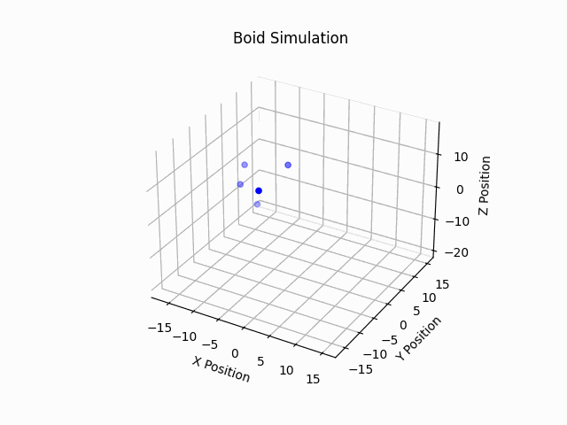
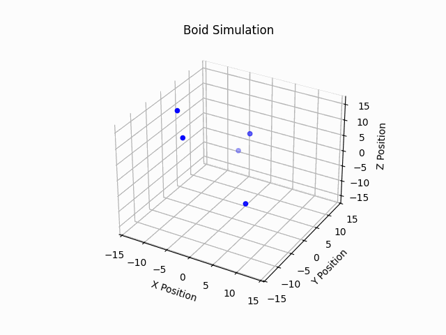

# Boid Simulation

This is a C++ project using OpenMP and MPI to perform a multi-threaded N-Body simulation, with the choice of using it on a supercomputer of interconnected compute nodes.

# Requirements

You will need access to mpiicpx for compilation, as well as usual libs like OpenMP.

If some dependencies are missing, it should just automatically work if you do this on BC4 itself.

# Setup

First git clone it to your area. The actual simulation source and header files are in the programFiles folder. 

```
git clone https://github.com/SmidgeonE/Comp401.git

cd Comp401
```

I have provided bash scripts to make compilation easy. It is under the 'scripts' dir:

```
./scripts/compile.sh -h
```

I have used std::array among other things so details of the sim have to supplied at compile time with flags. Not all have to be supplied at compile time, but I didn't want to have to deal with compile time + run time arguments.
Here is an example of compiling an executable of 15 Boids with 4 OpenMP threads, and a simulation bounding box of size 30, that will save the simulation to a local .csv called BoidSimulation.csv:

```
./scripts/compile.sh -t 4 -n 15 -b 30 -o
```

This will produce a binary in the current directory with the name *numBoids*.exe . This can then be ran:

```
./15.exe
```

## Note

I changed my mind, you can also add the separation, cohesion, and alignment constants at runtime as well to override the default values:

```
./15.exe <separationConstas> <cohesionConstant> <alignmentConstant>
```


Or, with MPI:

```
mpiexec -n <numMPIcores> ./15.exe <separationConstas> <cohesionConstant> <alignmentConstant>
```

Alternatively, this can be ran as a job on BC4. There is an example BC4 script in ./bc4/ that you can use.

# Visualisation

You may need to install polars for the visualisation part: 

```
pip install polars
```


Once the BoidSimulation.csv file has been made in the base directory, you can create a gif that shows whats happening. From the base directory you can run:

```
python3 ./utils/visualise.py
```

# Examples:

Some premade gifs of the simulations are in ./visualisationExamples

It will take like 10-20 secs to render. Once its done, a simulation.gif file will appear in the base directory.


The default parameters will showcase a fairly normal behaviour: a fairly well coupled group follow each other quite closely.


A high cohesion group will be extremely tight, but due to the separation force will be at a more unstable equilibrium. This instability causes some self-propelling effect of the group.



High separation causes the group to have a wider gap between the individual Boids, as per expectation.


Low Alignment means they do not form a coherent direction until much later in the simulation.



High separation and high alignment causes a highly stable flock, with a very specific direction, and not much intra-flock variation.


Low cohesion but high alignment has a vaguely similar effect, except there is much more 'lag' inside the flock, and occassionally it slingshots itself.


